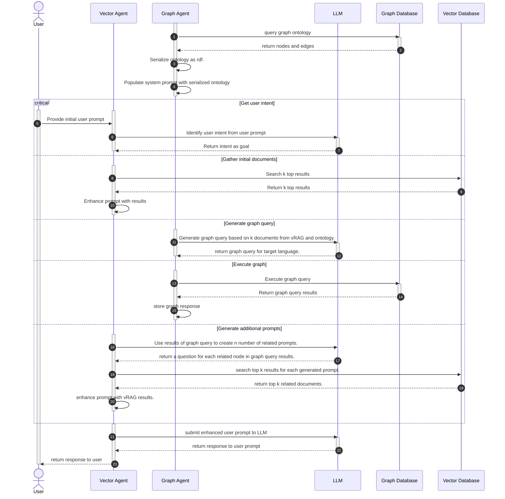

# Architecture Reference Docs

This document is currently a working document. The materials located here are subject to change.

## Logical Architecture

## Application Architecture

## Software Architecture

